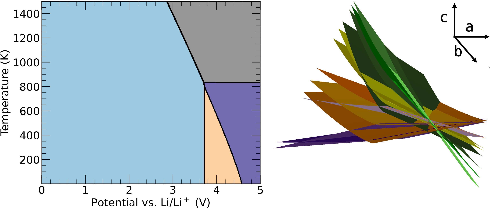
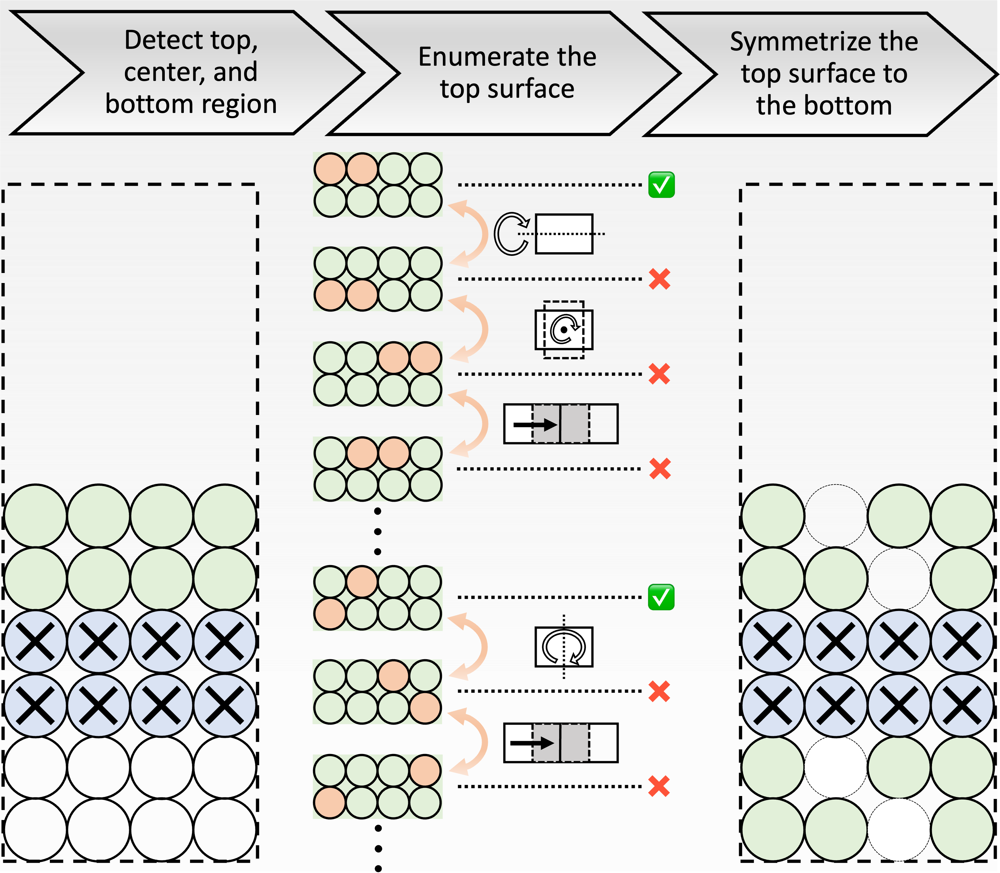

# Table of Contents
* [Introduction](#introduction)
* [surface-pd framework](#surface-pd-framework)
* [How to cite](#how-to-cite)
* [Documentation](#documentation)
* [Installation](#installation)
* [Using surface-pd](#using-suface-pd)


<a name="introduction"></a>
# Introduction
The surface degradation of layered transition metal (TM) oxide and other
related cathode compositions have been characterized extensively in
experiments, however how the reactions take place on the
cathode surface and the surface reconstructions form on the atomic scale is
still lacking.
The surface phase diagram as a function of the state of charge
and the temperature can offer insights into atomic-scale processes that are
challenging to probe experimentally.

<p align="center">
    
</p>

To construct the surface phase diagram, slab models
with different surface compositions need to be created. The surface phase
diagram shown on the left above only has four phases that are predicted to be
stable in the range of 0 to 5 V and 0 to 1500 K. However, behind the most
stable phases shown on the surface phase diagram, hundreds/thousands
meta-stable phases should also be calculated. The figure shown above on the
right illustrates how the three-dimensional surface phase diagram looks like
when "all" enumerated slab models are considered.

<a name="interphon-framework"></a>
# surface-pd framework
This package takes use of the method developed in [enumlib code](https://github.com/msg-byu/enumlib), but
in contrast to conventional enumlib code, we apply the systematic
enumeration to only part of the slab model, creating vacancies on
the surface. Then by taking the advantage of inherent inversion symmetry
center of the slab models, the top surface will be symmetrized to the bottom
surface, i.e. a symmetrically equivalent modification was introduced at the
bottom of the slab models. The below flowchart shows the framework of the
surface enumeration.

<p align="center">
    
</p>


<a name="how-to-cite"></a>
# How to cite
If you have used ***surface-pd***, please cite: 

**Paper to be cited**

Thank you for your interest.

<a name="documentation"></a>
# Documentation
If you want to learn more about ***surface-pd***, please find the [user manual](https://surface-pd.readthedocs.io/en/latest/index.html).

Or please contact: ```Xinhao Li, xinhao.li@columbia.edu```

<a name="installation"></a>
# Installation
surface-pd is a Python 3 package and the stable version can be installed via pip.
```
$ pip install surface-pd
```

<a name="using-surface-pd"></a>
# Using surface-pd
Please refer to the official [surface-pd](https://surface-pd.readthedocs.io/en/latest/index.html)
for tutorials and examples.

