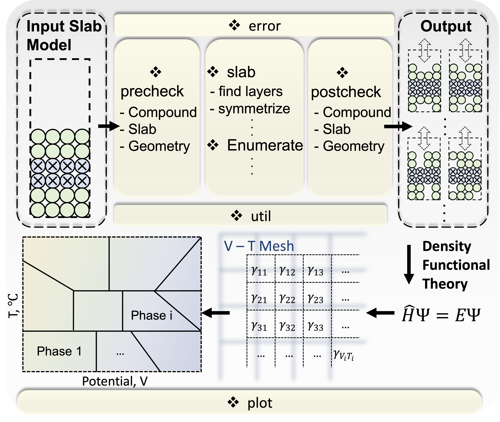

============
Introduction
============

Overview
********
The surface degradation of layered transition metal (TM) oxides and other
related cathode compositions has been characterized extensively in
experiments. However, how the reactions take place on the cathode surface
and how surface reconstructions form on the atomic scale remains unclear.
The surface phase diagram as a function of state of charge and temperature
can offer insights into atomic-scale processes that are challenging to probe
experimentally.

.. image:: images/2D-3D-surface-pd-demo.png
    :width: 600
    :align: center

To construct the surface phase diagram, slab models
with different surface compositions need to be created. The surface phase
diagram shown on the left above only has four phases that are predicted to be
stable in the range of 0 to 5 V and 0 to 1500 K. However, behind the most
stable phases shown on the surface phase diagram, hundreds/thousands
meta-stable phases should also be calculated. The figure shown above on the
right illustrates how the three-dimensional surface phase diagram looks like
when "all" enumerated slab models are considered.

Strategy
********
This package uses the method developed in the `enumlib code
<https://github.com/msg-byu/enumlib>`__. In contrast to the conventional
enumlib code, we apply systematic enumeration to only part of the slab model,
creating vacancies on the surface. By taking advantage of the inherent
inversion symmetry center of the slab models, the top surface is symmetrized
to the bottom surface, i.e., a symmetrically equivalent modification is
introduced at the bottom of the slab models. For a detailed description,
please see: :ref:`label_surface_enumeration`.

Architecture
************

The **surface-pd** package consists of the following **5** sub-packages:

- ``analysis`` sub-package includes analysis modules to analyze and manipulate the slab models.

- ``core`` sub-package includes core modules to check, build, enumerate, and symmetrize the slab models.

- ``error`` sub-package includes error modules defined for users to quickly identify the problems.

- ``plot`` sub-package includes plot modules to manage and analyze the DFT results, define the equations of surface free energy calculations, and construct the 3D surface phase diagrams.

- ``util`` sub-package includes util modules to define some utility functions.
